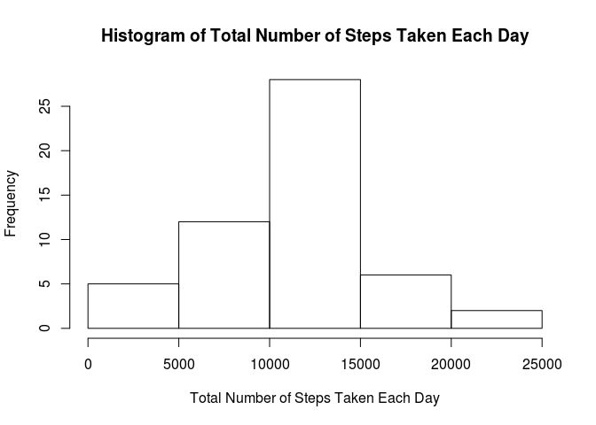
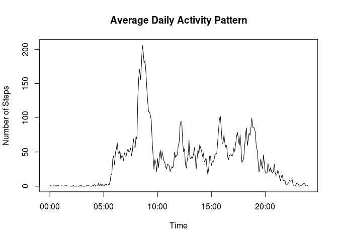
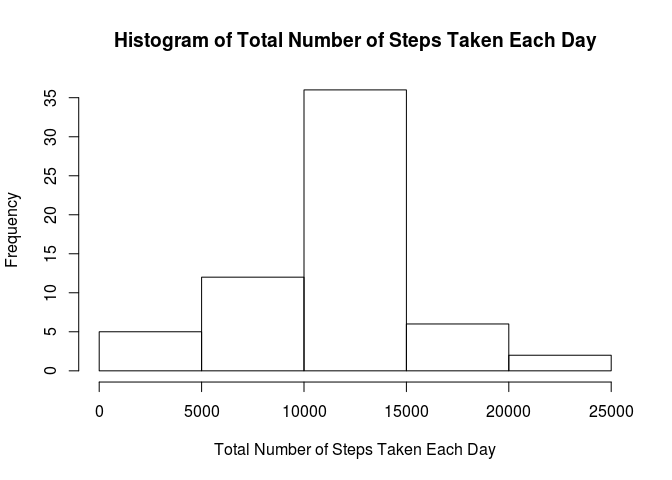
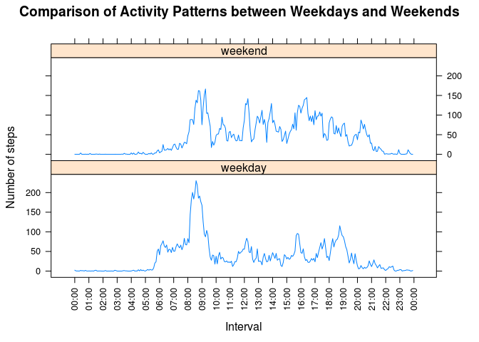

# Reproducible Research: Peer Assessment 1
So Agung Sidharta  


## Loading and preprocessing the data

```r
activity <- read.csv("activity.csv")
activity$date <- as.Date(activity$date)
```


## What is mean total number of steps taken per day?

```r
total_steps_per_day <- tapply(activity$steps, activity$date, sum)

hist(total_steps_per_day, xlab = "Total Number of Steps Taken Each Day", 
  main = "Histogram of Total Number of Steps Taken Each Day")
```

 

```r
mean_total_steps_per_day <- format(mean(total_steps_per_day, na.rm = TRUE))
median_total_steps_per_day <- format(median(total_steps_per_day, na.rm = TRUE))
```

Mean of the total number of steps taken per day is : <b>10766.19</b>

Median of the total number of steps taken per day is : <b>10765</b>


## What is the average daily activity pattern?

```r
activity$time <- formatC(activity$interval, width = 4, format = "d", flag = "0")
activity$time <- sub("([[:digit:]]{2,2})$", ":\\1", activity$time) 
activity$time <- as.POSIXct(activity$time,format="%H:%M")

avg_daily_activity_pattern <- tapply(activity$steps, activity$time, mean, na.rm = TRUE)
plot(x = as.POSIXct(substr(names(avg_daily_activity_pattern), 12, 16), format="%H:%M"), y = avg_daily_activity_pattern, type = "l",main="Average Daily Activity Pattern",ylab="Number of Steps",xlab="Time")
```

 

```r
biggest_5_min_interval <- activity$interval[which(avg_daily_activity_pattern==max(avg_daily_activity_pattern))]
```

<b>835</b> is the 5-minute interval, on average across all the days in the dataset, containing the maximum number of steps


## Imputing missing values

```r
x <- table(complete.cases(activity))
names(x) <- c("Number of Rows with Missing Values", "Number of Rows without Missing Values")
library(xtable)
print(xtable(x), type="html")
```

<!-- html table generated in R 3.1.2 by xtable 1.7-4 package -->
<!-- Sun Sep 20 17:10:20 2015 -->
<table border=1>
<tr> <th>  </th> <th> x </th>  </tr>
  <tr> <td align="right"> Number of Rows with Missing Values </td> <td align="right"> 2304 </td> </tr>
  <tr> <td align="right"> Number of Rows without Missing Values </td> <td align="right"> 15264 </td> </tr>
   </table>

```r
activity_2 <- activity

#The strategy is filling missing values with mean of its 5-minute interval
for(i in which(complete.cases(activity_2)==FALSE)){
    y <- formatC(activity_2$interval[i], width = 4, format = "d", flag = "0")
    y <- sub("([[:digit:]]{2,2})$", ":\\1", y)
    y <- which(substr(names(avg_daily_activity_pattern), 12, 16)==y)
    activity_2$steps[i] <- avg_daily_activity_pattern[y]
}

total_steps_per_day_2 <- tapply(activity_2$steps, activity_2$date, sum)

hist(total_steps_per_day_2, xlab = "Total Number of Steps Taken Each Day", 
  main = "Histogram of Total Number of Steps Taken Each Day")
```

 

```r
mean_total_steps_per_day_2 <- format(mean(total_steps_per_day_2))
median_total_steps_per_day_2 <- format(median(total_steps_per_day_2))
```

Mean of the total number of steps taken per day is : <b>10766.19</b>

Median of the total number of steps taken per day is : <b>10766.19</b>

Using the strategy of <b>filling missing values with mean of its 5-minute interval</b> makes mean and median total number of steps taken per day become equal


## Are there differences in activity patterns between weekdays and weekends?

```r
library(reshape2)
library(lattice)
activity_2$weekend <- weekdays(activity_2$date) %in% c("Saturday", "Sunday")
activity_2_melt <- melt(activity_2, id=c("weekend","time"), measure.vars = c("steps"))
avg_daily_activity_pattern_2 <- dcast(activity_2_melt, 
                                      weekend + time ~ variable, mean)
avg_daily_activity_pattern_2$weekend[avg_daily_activity_pattern_2$weekend==TRUE] <- "weekend"
avg_daily_activity_pattern_2$weekend[avg_daily_activity_pattern_2$weekend==FALSE] <- "weekday"
avg_daily_activity_pattern_2$weekend <- as.factor(avg_daily_activity_pattern_2$weekend)
xscale <- seq(avg_daily_activity_pattern_2$time[1], by="1 hour", length=25)
xyplot(steps ~ time | weekend, data = avg_daily_activity_pattern_2, layout = c(1, 2), type = "l", ylab = "Number of steps", xlab = "Interval", main = "Comparison of Activity Patterns between Weekdays and Weekends", scales = list(x = list(at=xscale,labels=format(xscale,"%H:%M"),rot=90)))
```

 
